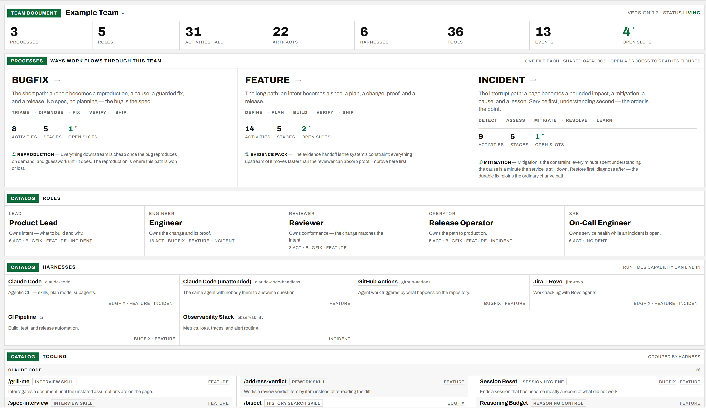
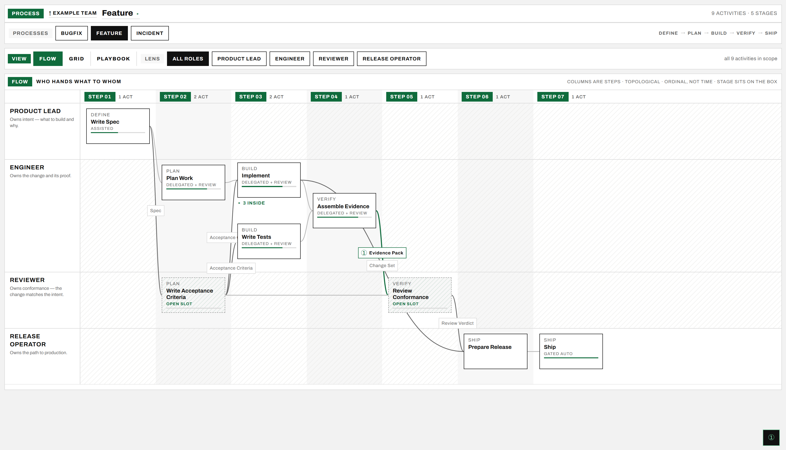
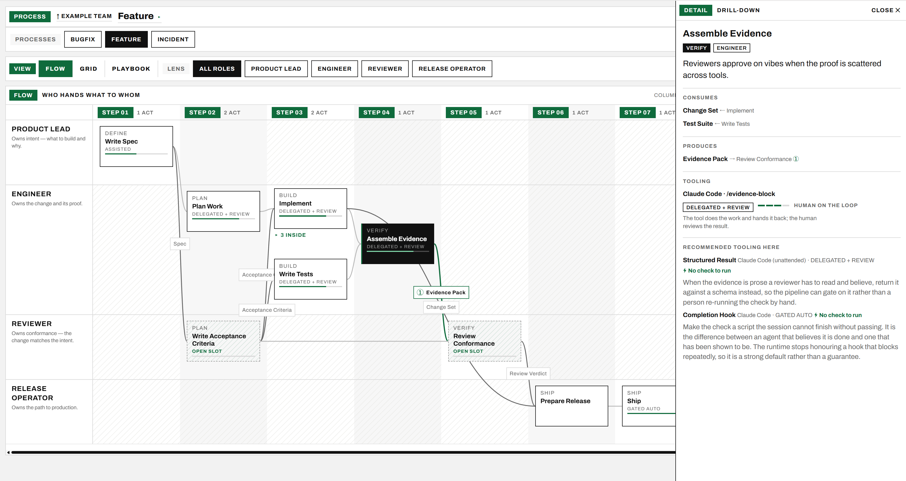

# ai-sdlc

**A composer of project delivery processes.** Write in YAML how a team delivers changes and where AI is utilized — activities, roles, artifacts, stages, tool fills, and the gaps the team has declared. `ai-sdlc` renders it into an interactive site: a flow swimlane, a stage×role grid, drill-down panels per activity and per role.



> Status: prototype. The schema is still being firmed up; expect churn.

## Why

Teams describe their process in slides that go stale the day after the workshop. Here the process is a document under version control, the diagram is generated from it, and the parts nobody has solved yet — **open slots** — render as visible dashed gaps rather than quietly disappearing. The declared gaps are the roadmap.

## What it renders

The team document above is the index: every process, every catalog, and the counts that say how much of the model is filled in. Opening a process draws it as a swimlane — one lane per role, columns as topological steps, artifacts riding the arrows between activities. Dashed boxes are the open slots.



Every box opens a drill-down: what the activity consumes and produces, which tool fills it and at what rung of the delegation ladder, and what tooling is recommended where nothing is attached yet.



## Install

Node.js >= 22.18.

```sh
git clone <this repo> ai-sdlc
cd ai-sdlc
npm install
```

The CLI is exposed as `ai-sdlc` (via `package.json` `bin`). Either `npm link` it, or call it directly:

```sh
node bin/ai-sdlc.mjs --help
```

## Quick start

```sh
# 1. write a skeleton team folder anywhere on disk
node bin/ai-sdlc.mjs new ~/teams/acme --name "Acme Delivery"

# 2. render it, and leave this running
node bin/ai-sdlc.mjs serve ~/teams/acme

# 3. edit the YAML — the page hot-reloads beside you
```

To see a filled-in example instead, render the reference team that ships with the repo:

```sh
npm run dev        # serves examples/reference at http://localhost:4321
```

## Commands

| Command | What it does |
| --- | --- |
| `ai-sdlc new <team-dir> [--name <name>]` | Write a skeleton team folder — the smallest document the schema accepts and the renderer draws |
| `ai-sdlc serve <team-dir> [--port <n>] [--host]` | The mapping-session surface: dev server with hot reload on YAML edits |
| `ai-sdlc export <team-dir> [--out <file>]` | One self-contained HTML file that opens from disk — no server, no assets |
| `ai-sdlc check <team-dir>` | Validate the YAML against the schema. Exits non-zero on problems |
| `ai-sdlc status <team-dir>` | Inventory how complete the document is. Always exits 0 |
| `ai-sdlc example [--copy <dir>] [--path]` | Serve the worked example that ships with the package, copy it to edit, or print the folder it lives in |

`<team-dir>` is required everywhere — there is no default and no cwd sniffing. The folder name is the team id; each file name under `processes/` is that process id.

`check` and `status` answer different questions and only `check` is a gate. `check` is schema-only. An id that an activity references but no catalog defines is schema-legal, so `check` passes it — `status` is what reports it.

## The team folder

```
acme/
  team.yaml                 who the team is, and the roles every figure is drawn along
  artifacts.yaml            one shelf per file — the joints every arrow is derived from
  harnesses.yaml            the runtimes the team has
  tools.yaml                the concrete things inside them, named so activities can use them
  events.yaml               the recurring moments a recommendation can hang on
  processes/
    delivery.yaml           stages, activities, tooling fills, the ① constraint
    bugfix.yaml             a second process, same team, same catalogs
```

A catalog file may also be written inline in `team.yaml` under the same key, which is the shorter form for a document with four artifacts and no tools yet. Never both: `check` fails a shelf declared twice rather than pick one.

An activity is the atomic unit:

```yaml
- id: write-spec
  name: Write Spec
  stage: define
  roles: [lead]
  produces: [spec]
  why: Work without a written intent gets re-litigated at review time.
  tooling:
    tool: spec-interview
    level: assisted
```

Three states an activity can be in, and they render differently on purpose:

- **Filled** — `tooling: {tool, level}`. Capability attached to work, at a stated rung of the delegation ladder (`manual` → `assisted` → `delegated-review` → `gated-autonomous`).
- **Open slot** — `open: {need}`. A gap the team has declared, plus what would fill it. Draws dashed.
- **Unclaimed** — neither. Work the team does itself and has asked for nothing on. Draws plain, and is not a gap.

## Authoring a team

A document is meant to be written *live*, in a mapping session: editor and browser side by side, the team talking, the page redrawing as their sentences become YAML. The `skills/mapping-session/` skill conducts that interview — it translates the team's own words into the model, so nobody has to learn the schema before speaking. It reads the vocabulary from `skills/sdlc-ontology/`, the base skill both authoring skills share.

This repository is also a Claude Code plugin marketplace holding all three skills:

```sh
claude plugin marketplace add NikiforovAll/ai-sdlc
claude plugin install ai-sdlc@ai-sdlc
```

Installed that way the skills are namespaced — `/ai-sdlc:mapping-session`, `/ai-sdlc:auto-mine-repo`.

For any other agent, the [skills](https://github.com/vercel-labs/skills) CLI reads the same `skills/` folder:

```sh
npx skills add NikiforovAll/ai-sdlc            # this project only
npx skills add NikiforovAll/ai-sdlc --global   # every project
```

`-a`/`--agent` picks the agent when you have more than one, `npx skills list` shows what is installed, and `npx skills update` pulls later revisions.

Either way the skills drive the `ai-sdlc` CLI, which is a separate install — see [Install](#install).

Then, with a team folder and the renderer up:

```sh
ai-sdlc new ~/teams/acme
ai-sdlc serve ~/teams/acme      # put this on the shared screen
# then, in Claude Code: /ai-sdlc:mapping-session ~/teams/acme
```

### When the process is already written down

Some repositories describe their own delivery process — an agentic bundle names its skills, its agents, its gates and the artifacts they pass. There is nothing to interview: the `skills/auto-mine-repo/` skill reads that package unattended and writes the YAML from it, then hands the folder to `mapping-session` so a team can cut what does not apply to them.

```sh
# in Claude Code, pointed at the package you want read
/ai-sdlc:auto-mine-repo ~/src/some-bundle --into ~/teams/some-bundle
```

It stops once, for the three calls the source cannot settle — how many documents, how the processes are cut, how fine the artifacts are — and finishes without stopping again. A mined document says so in its own masthead — `status: draft` — because it describes a package until a team has confirmed it. Its roles are inferred, its open slots are quoted from the package's own roadmap, and nothing is filled that the source did not state.

## The model

`docs/ontology/` walks the vocabulary in dependency order — each layer only uses terms defined before it. It is a reference for maintaining a document, not a prerequisite for writing one.

| Layer | Concepts |
| --- | --- |
| [01 — Process spine](docs/ontology/01-process-spine.md) | Team, Process, Role, Stage, Activity, Artifact |
| [02 — Derived structure](docs/ontology/02-derived-structure.md) | Edge, Handoff, ordinal order, ① Constraint |
| [03 — Capability fills](docs/ontology/03-capability-fills.md) | Harness, Tool, Fill, Level ladder, Open slot |
| [04 — Recommendations & events](docs/ontology/04-recommendations-and-events.md) | Recommendation, Event |
| [05 — Recursion](docs/ontology/05-recursion.md) | Sub-activity, Sub-process |

Two properties worth stating up front, because they rule out a whole class of expectations:

- **Document, not timeline.** Sequence is ordinal — a topological sort of artifact edges. No durations, no calendar, no lead-time metrics.
- **Forward-only DAG.** Rework and back-edges are never drawn. Every reader already assumes them, so drawing them costs ink and buys nothing.

## Development

```sh
npm run dev        # reference team, hot reload
npm run build      # the gate
npm run check      # validate the reference team's YAML
npm run export     # reference team → _exports/reference.html

npm run dev:coverage     # the coverage fixture, hot reload
npm run check:coverage   # validate it
```

There is no test suite and no linter. `npx astro build` is the gate: a clean build reporting the expected page count is the evidence a change holds.

Two teams ship with the repo. `examples/reference` is the realistic document a reader is meant to learn from — it lives inside the package, which is what makes `ai-sdlc example` work on a machine that never cloned this repo. `fixtures/coverage` is the opposite: every schema field present once, every optional field absent once, so a rendering branch that `reference` happens not to reach is still drawn somewhere. A new schema field belongs in `fixtures/coverage` the same commit it enters `schema.ts`.

## Design documents

| Document | Read it before |
| --- | --- |
| [`PRODUCT.md`](PRODUCT.md) | changing what the product does, who it serves, or its scope |
| [`DESIGN.md`](DESIGN.md) | changing anything visual |
