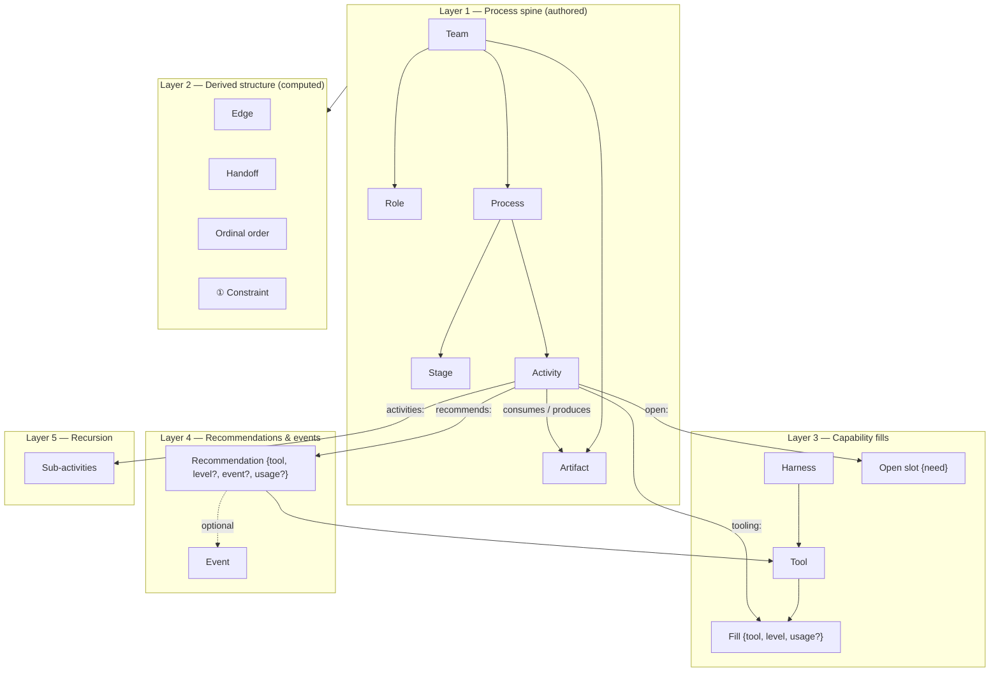

# The Ontology — Overview

> Status: stub. Filled in last, once the vocabulary in layers 1–5 is locked.

A team document is one folder of YAML — `team.yaml`, a file per shared catalog, and `processes/*.yaml` — describing how a team delivers changes and where AI is utilized. Everything you see rendered is either **authored** (you wrote it) or **derived** (the composer computed it from what you wrote). The ontology docs walk the model in dependency order — each layer only uses vocabulary defined before it.

> **These docs are a reference, not a prerequisite.** Nobody reads five documents before starting. To author a new team, run `ai-sdlc new <dir>` and then the `mapping-session` skill, which teaches the vocabulary by translating a team's own sentences into it during the mapping session. Come back here afterwards, when you are maintaining the document rather than writing it. See `_plans/spec-authoring.md`.

## Reading order

| Doc | Concepts | You learn to |
|---|---|---|
| [01 — Process spine](01-process-spine.md) | Team, Process, Role, Stage, Activity, Artifact | Write the skeleton of a team document |
| [02 — Derived structure](02-derived-structure.md) | Edge, Handoff, ordinal order, ① Constraint | Read what the composer draws that you never wrote |
| [03 — Capability fills](03-capability-fills.md) | Harness, Tool, Fill, Level ladder, Open slot | Say where AI sits in the process, where the team has declared a gap, and where the work stays theirs |
| [04 — Recommendations & events](04-recommendations-and-events.md) | Recommendation, Event | Attach capability to situations, not just process positions |
| [05 — Recursion](05-recursion.md) | Sub-activity, Sub-process | Zoom into an activity without leaving the model |

## Glossary

| Term | One-liner | Layer |
|---|---|---|
| Team | The document: one folder, one team, owning the shared catalogs and running one or more processes | 1 |
| Process | One named way work flows (feature, bugfix); owns its stages, activities, and optional constraint | 1 |
| Role | A hat someone wears — a locus of ownership; the vertical axis of every figure | 1 |
| Stage | A named phase labeling activities; a coarse map, never a gate | 1 |
| Activity | The atomic unit of work: roles + stage + consumes/produces | 1 |
| Artifact | A named, inspectable thing work leaves behind; the joints of the process | 1 |
| Edge | Derived connection: someone's produces matching someone's consumes | 2 |
| Handoff | An edge whose two activities share no role | 2 |
| Ordinal order | Derived left-to-right position: dependency depth, never time | 2 |
| ① Constraint | The one artifact handoff the team names as its bottleneck | 2 |
| Harness | A runtime the team has: agentic CLI, tracker agents, CI | 3 |
| Tool | A concrete usable thing inside a harness; inventory with an id, never usage | 3 |
| Fill | `{tool, level, usage?}` on an activity — capability attached to work | 3 |
| Level ladder | Degree of delegation: manual → assisted → delegated-review → gated-autonomous → autonomous; read as HITL, where the human stands (in / on the loop, at the gate, or nowhere) | 3 |
| Open slot | `{need}` on an activity — a gap the team has declared, and what would fill it: the roadmap | 3 |
| Unclaimed | An activity with neither `tooling:` nor `open:` — work the team does itself and has asked for nothing on. Draws plain; not a gap | 3 |
| Recommendation | An entry under an activity: another tool worth reaching for here, optionally for one moment | 4 |
| Event | A named recurring moment a recommendation can be for; carries no mechanics | 4 |
| Sub-activity | An activity inside an activity; inherits its parent's stage, keeps every other field | 5 |
| Sub-process | The children of one activity, taken together: a closed picture with its own derived structure | 5 |
