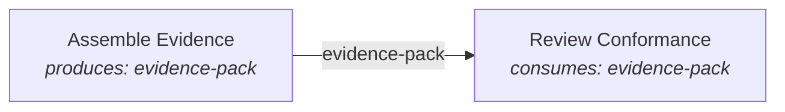

# Layer 2 — Derived Structure

Nothing in this layer is authored. Every concept here — edges, handoffs, order, the constraint's edge — is computed from the spine you wrote in [Layer 1](01-process-spine.md). This is the model's payoff: you maintain facts (who consumes what), and the composer maintains the picture. When the picture looks wrong, you don't move boxes — you fix the facts.

Four concepts: **Edge**, **Handoff**, **Ordinal order**, and the **① Constraint**.

---

## Edge

**Definition.** A connection drawn from activity A to activity B because A produces an artifact that B consumes. The edge *is* the artifact changing hands.

**Why it exists.** You never draw arrows; declaring flow separately from inputs would let the two drift apart until the diagram lies. Deriving edges from consumes/produces makes the picture checkable against the facts.

**How it's derived.**



For every artifact in an activity's `consumes:`, the composer finds the activity that `produces:` it and draws one labeled edge. An artifact consumed by three activities yields three edges from its one producer. A consumed artifact nobody produces yields no edge — it silently marks an input from outside the process.

**How it renders.** Labeled connector lines between nodes in FIG.01; the "← producer" / "→ consumers" lines in the drawer.

**Invariants & non-meanings.**
- An edge is not a trigger, a message, or a schedule. It reads "B needs what A made", never "A finishing starts B".
- Edges never cross process boundaries — each process's flow is derived from its own activities only.

---

## Handoff

**Definition.** An edge whose producer and consumer share no role: the artifact crosses an ownership boundary.

**Why it exists.** Handoffs are where delivery processes lose time and information — queues form, context is re-explained, quality is argued. The model surfaces them so a team can count and interrogate them, and it derives them (from role sets, not declarations) so they can't be undercounted.

**How it's derived.** For each edge, compare role lists: if the producing activity and the consuming activity have no role in common, the edge is a handoff. An engineer passing a change-set to a reviewer is a handoff; an engineer's task-list feeding the engineer's own write-change is not.

**How it renders.** A distinct edge treatment in FIG.01; the "N HANDOFF" count in each stage band's caption; the handoffs stat in the masthead (marked *derived*).

**Invariants & non-meanings.**
- A handoff is not a bad thing to be minimized to zero — it's a *cost to be spent deliberately*. The review handoff is the point of having a reviewer.
- Sharing even one role neutralizes a handoff: an activity done by `[lead, engineer]` hands off to nothing the engineer does alone.

---

## Ordinal order

**Definition.** Each activity's left-to-right position: its depth in the dependency graph — how long the longest chain of edges is that leads to it.

**Why it exists.** A figure needs an x-axis, and the honest one is dependency depth: everything an activity transitively needs sits somewhere to its left. Anything more (dates, durations, swim-by-sprint) would smuggle in claims the document doesn't make.

**How it's derived.** Longest-path layering: activities consuming nothing (or only outside inputs) sit in column 0; every other activity sits one column right of the deepest producer it consumes from. Stage bands then span the columns their activities landed in.

**How it renders.** The column grid of FIG.01, and the stage bands' widths. The figure's own caption states the contract: *x-order derived · topological · ordinal, not time*.

**Invariants & non-meanings.**
- **Ordinal, never time.** Column width means nothing; two activities in one column are not simultaneous; a five-column process is not longer-running than a three-column one. No dates, durations, or deadlines exist anywhere in the model.
- **Rework is assumed, never drawn.** Everyone knows a review verdict can send work leftward; drawing those back-edges would double the ink to state the obvious. The flow shows the *dependency* direction only. (Rework enters the model as an *event* — see Layer 4.)
- Stages don't order anything. If a "later" stage's activity consumes nothing from an "earlier" one, it will sit left of where you expect — and that surprise is information, not a rendering bug.
- The activity graph must be acyclic: A consuming what B produces while B consumes what A produces is a modeling contradiction. (The composer guards against the cycle rather than crashing, but the model's promise is a DAG.)

---

## ① Constraint

**Definition.** The one artifact a process names as its bottleneck: the handoff where the whole system's throughput is decided.

**Why it exists.** Theory of constraints, applied to the document: at any moment one link limits the system, and improvement anywhere else is vanity. Naming the constraint *in the document* forces the team to have the argument once, write down the reasoning, and aim tooling investment at it first.

**Shape** (authored — the one authored thing in this layer):

```yaml
constraint:
  artifact: evidence-pack
  note: >-
    Everything upstream moves faster than the reviewer can absorb proof.
    Improve here first.
```

**How it renders.** The ① marker on the constraint artifact's edge in FIG.01; the full-width inverted constraint strip restating the note; the ① beside that artifact in the drawer.

**Invariants & non-meanings.**
- Exactly zero or one per process. A team that names two constraints has named none.
- The constraint marks an *artifact edge*, not an activity or a person. The claim is "this handoff limits us", never "this role is slow".
- It is a present-tense diagnosis, expected to move: once the evidence handoff is fixed, the constraint migrates elsewhere and the document should follow.

---

## What you can now read

Given any spine, you can read the whole derived picture: every edge as an artifact changing hands, handoffs as ownership crossings worth counting, left-to-right as pure dependency depth, and the ① as the team's own claim about where its throughput dies. Next: how AI capability attaches to this structure — [Layer 3, Capability fills](03-capability-fills.md).
